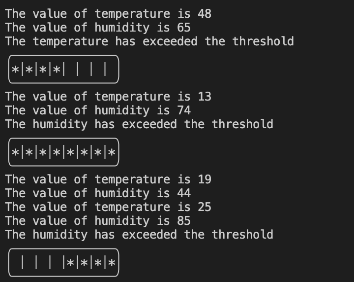

# Simulating Temperature and Humidity Sensor Monitoring with FreeRTOS Notifications.

## Outline
In this example, we simulate a scenario where two sensors —one for temperature and one for humidity— read their respective values. 
The monitoring of their values is facilitated by FreeRTOS notifications. 
If the temperature tolerance threshold is exceeded, a notification is sent, and the temperature notification handler responds by illuminating the first half of the LEDs.
Instead, if the humidity tolerance threshold is exceeded, the humidity notification handler lights up the second half of the LEDs.

## Step by step implementation

Notifications are a lightweight inter-task communication mechanism provided by FreeRTOS, allowing tasks to interact with each other
without the need for a separate communication object. 
By using a task notification, a task (or ISR) can send an event directly to the receiving task.

First and foremost, it is important to note that task notification functionality is optional.
To include task notification functionality, set `configUSE_TASK_NOTIFICATIONS` to 1 in `FreeRTOSConfig.h`.

 ```c
 #define configUSE_TASK_NOTIFICATIONS    1 
 ```

When `configUSE_TASK_NOTIFICATIONS` is set to 1, each task has a Notification State, which can be either "Pending" or "Not-Pending", and a "Notification Value", which is a 32-bit unsigned integer.
When a task receives a notification, its notification state is set to pending. When a task reads its notification value, its notification state is set to not-pending.

In this example, we use 40 and 65 as threshold values for temperature and humidity, respectively.

### Used Tasks:

1. **vSensorReadTask:** simulates readings from two sensors (temperature and humidity) by generating random values. 
This task checks the values every 5 seconds, and if they exceed the defined threshold, a notification is sent using `xTaskNotifyGive()`.
`xTaskNotifyGive()` sends a notification directly to a task and increments (adds one to) the
receiving task’s notification value. 
`xTaskNotifyGive()` takes, as an input parameter, the handle of the task to which the notification is being sent. 
Calling `xTaskNotifyGive()` will set the receiving task’s notification state to pending.

   ```c
   
void vSensorReadTask(void *pvParameters)
{
    //Logic for set the frequency to read values every 5 seconds

    while (1)
    {
        //[...]
        //Logic for generate temperature and humidity random values
        //[...]

        if (temperature > TEMPERATURE_THRESHOLD)
        {
            xTaskNotifyGive(xTemperatureNotificationHandlerTask); //Send temperature notification
        }
		
        if (humidity > HUMIDITY_THRESHOLD)
        {
            xTaskNotifyGive(xHumidityNotificationHandlerTask); //Send humidity notification
        }

        vTaskDelayUntil(&xLastWakeTime, xFrequency);
    }
}

   ```
2. **vTemperatureNotificationHandlerTask:** is the task that handle the temperature notification.
This task will wait until it receives a notification, so everytime the temperature tolerance threshold is exceeded this task exits the blocked state.
This task uses ulTaskNotifyTake, which is a function that allows a task to wait in the blocked state until its notification value is greater than zero. 
When a notification is sent this task, as a specific action for the temperature notification, lights up the first half of the LEDs (from position 0 to position 3).

`ulTaskNotifyTake()` has two input parameters, `xClearCountOnExit` and `xTicksToWait`, the first one can be set to pdTRUE or pdFalse 
while the second one indicate the maximum amount of time the calling task should remain in the blocked state to wait for its notification value to be greater than zero 
(and either decrements - subtracts one from - or clears the task’s notification value).

In our case we set `xClearCountOnExit` to `pdTRUE`, it means that the calling task’s notification value will be cleared to zero before the call to `ulTaskNotifyTake()` returns. 
(If `xClearCountOnExit` is set to `pdFALSE`, and the calling task’s notification value is greater than zero, then the calling task’s notification value will be decremented
before the call to ulTaskNotifyTake() returns.)
xTicksToWait is set to portMAX_DELAY, this will cause our task to wait indefinitely (without timing out).


```c

static void vTemperatureNotificationHandlerTask(void *pvParameters)
{
	(void)pvParameters;

	while(1)
	{
		ulTaskNotifyTake(pdTRUE, portMAX_DELAY);
	
		printf("The temperature has exceeded the threshold\n");
		Switch_On_First_Half_Leds();
		printLeds();
		
	}

}
   ```

3. **HumidityNotificationHandlerTask:** is a task very similar to the previous one (`vTemperatureNotificationHandler`). 
What changes is the action after receiving the notification. Indeed, as soon as this task receives a notification and is awakened, it lights up the second half of the LEDs (from position 4 to position 7).

4. **vLedTask:** is a task responsible for turning off all LEDs at regular intervals (10 seconds). 
It uses vTaskDelayUntil function to pause its execution until a specified time interval, defined by xFrequency. 
Once the specified interval is reached, it calls the function `Switch_All_Led_Off()` to turn off all the LEDs. 
The task then continues to wait for the next time interval, repeating this process indefinitely.

```c
  void vLedTask(void *pvParameters) {

	(void)pvParameters;
    TickType_t xLastWakeTime = xTaskGetTickCount();
    const TickType_t xFrequency = pdMS_TO_TICKS(10000); //every 10 seconds

    while (1) 
	{
        vTaskDelayUntil(&xLastWakeTime, xFrequency);
        Switch_All_Led_Off();
    }
}

   ```

### LED initialization and functions used to turn on and off the LEDs
In order to use and manipulate the LEDs on this board, we use LED_REGISTER (reference al readme di Genova)

We use `Switch_On_First_Half_Leds` and `Switch_On_Second_Half_Leds` to turn on the first half or the second half of the LEDs

`Switch_On_First_Half_Leds` calculates an 8-bit mask with the first 4 bits set to 1 and uses it to turn on only the first half of the LEDs. 
The mask is then "OR"ed with the `LED_REGISTER``

```c

  void Switch_On_First_Half_Leds()
{
	//Calculate the mask to turn on only the first half of the LEDs
	uint8_t mask = (1 << 4) - 1;

	//Turn on only the first half of the LEDs
	LED_REGISTER |= mask;
}

   ```

`Switch_On_Second_Half_Leds` calculates an 8-bit mask with the last 4 bits set to 1 and shifts them to the second half of the byte. 
The mask is then "OR"ed with the LED_REGISTER.

```c

  void Switch_On_Second_Half_Leds()
{
	//Calculate the mask to turn on only the second half of the LEDs
	uint8_t mask = ((1 << 4) - 1) << (4);

	//Turn on only the second half of the LEDs	
	LED_REGISTER |= mask; 
}

   ```

We use also the function `printLeds` that monitors the state of LEDs and draws a LED grid to illustrate which LEDs are on and off.

