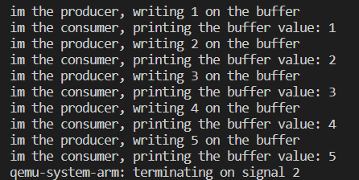

# FreeRTOS Producer-Consumer Example

This is a simple example of a Producer-Consumer pattern implemented using FreeRTOS on an embedded system. In this example, two tasks (`producerTask` and `consumerTask`) communicate through a shared buffer protected by a mutex.

## Prerequisites

- [FreeRTOS](https://www.freertos.org/): Make sure you have FreeRTOS set up for your target environment.

## Usage

1. Clone the repository or download the source code.
2. Set up FreeRTOS for your target environment.
3. Compile and run the code on your target platform.

## Run with QEMU

### Simulation Setup

To simulate the FreeRTOS Producer-Consumer example using QEMU, follow these steps:

1. Ensure you have [QEMU](https://www.qemu.org/) installed on your system.

2. Open a terminal and navigate to the directory containing your compiled FreeRTOS application binary (`RTOSDemo.out`).

3. Run the following command:
```console
qemu-system-arm -machine mps2-an385 -cpu cortex-m3 -kernel RTOSDemo.out
```

## Code Overview

The `main` function initializes the FreeRTOS environment, creates tasks, and starts the scheduler. The `producerTask` writes data to the shared buffer, and the `consumerTask` reads and prints the buffer value.

```c
void main(void) {
    // Initialization code...

    xTaskCreate(producerTask, "producer", 1000, (void *)42, 3, NULL);
    xTaskCreate(consumerTask, "consumer", 1000, NULL, 1, NULL);
    vTaskStartScheduler();

    // Main loop...
}

# Tasks
#Producer Task
#The 'producerTask' function writes data to the shared buffer.

static void producerTask(void *pvParameters)
{
	//arv val base on the parameter passed to the task

	for (int i = 1; i <= argVal; i++)
	{
		xSemaphoreTake(xMutex, portMAX_DELAY);
		{
			vTaskDelay(1000);
			buffer = i;
			printf("im the producer, writing %d on the buffer \n\r", buffer);
		}
		xSemaphoreGive(xMutex);
		vTaskDelay(3000);
	}

	vTaskDelete(consumerHandle);
	vTaskDelete(NULL);
}


# Consumer Task
#The consumerTask function reads and prints the buffer value.

static void consumerTask(void *pvParameters) {
    // Consumer task code...

    printf("I'm the consumer, printing the buffer value: %d\n", buffer);

    // More consumer task code...

    vTaskDelete(NULL);
}
```
## Example image



