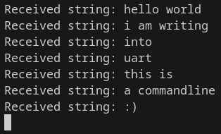
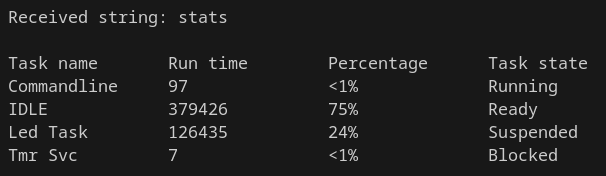
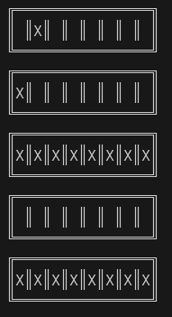

# UART Command Line with Interrupts

This code is designed to allow users to execute commands through the
UART console efficiently. The implementation features a UART command
line interface with interrupts, eliminating the need for
resource-intensive polling methods. This approach ensures that when the
user is not actively using the keyboard, the CPU can be used for
other tasks or transition to an IDLE state to conserve resources and
energy.



### Interrupt Handling

Upon asynchronous input of a character from the keyboard, the
`UART0RX_Handler` routine is activated to handle the reception. This
routine extracts the character from the UART data register and forwards
it to a FreeRTOS queue. `vCommandlineTask` will be in Blocked state waiting to 
receive these characters from that queue and will process the string commands.

```c
void UART0RX_Handler(void) {
    if (UART0_INTSTATUS == 2) {     // Check if RX interrupt occurred
        char c = UART0_DATA;        // Read character 
        xQueueSendToBackFromISR(xQueueUART, &c, NULL);  // Send the character to FreeRTOS queue
        UART0_INTSTATUS = 2;        // Clear interrupt status
    }
    portEND_SWITCHING_ISR(pdTRUE);  // Request context-switch to run a task without waiting for next SysTick
}

void UART0RX_Handler(void){
    BaseType_t xHigherPriorityTaskWoken = pdFALSE;
    if (UART0_INTSTATUS == 2){	// Check if RX interrupt occurred
        char c = UART0_DATA;	// Read character 
        xQueueSendToBackFromISR(xQueueUART, &c, &xHigherPriorityTaskWoken); // Send the character to FreeRTOS queue
        UART0_INTSTATUS = 2;	// Clear interrupt status
    }
    portEND_SWITCHING_ISR(xHigherPriorityTaskWoken);    // Request context-switch to run a task without waiting for next SysTick
}

static void vCommandlineTask(void *pvParameters) {
    char c;
    char inputString[NORMALBUFLEN];  
    while(1){
        int index = 0;
        while (index < NORMALBUFLEN-1) {
            xQueueReceive(xQueueUART, &c, portMAX_DELAY);   // Puts the task in Blocked state and wait for the character received from the ISR

            if (c == '\r') {    // Break if '\r' is entered, i.e., if enter is pressed
                break;
            }

            inputString[index] = c;     // Add character to string
            index++;
        }
        inputString[index] = '\0';      // Add string terminator
        
        executeCommand(inputString);    // Execute command
    }
}
```

### UART Initialization

The UART initialization function (`prvUARTInit`) handles the
configuration of the UART module, manages NVIC settings for
the UART RX interrupt and creates a FreeRTOS queue for UART data.

-   **BAUDDIV:** The divider is set to the minimum value (16) to achieve
    the maximum baud rate(number of symbols per second), ensuring faster character reception with
    fewer CPU cycles.

-   **CTRL:** The value 11 is employed to enable receiving,
    transmitting, and to activate the RX interrupt.

-   **NVIC (Nested Vectored Interrupt Controller):** This controller efficiently handles interrupts, closely integrated with the processor core for low-latency processing. In the provided code snippet, we enable our UART RX handler to execute upon the arrival (to the CPU) of a UART RX interrupt (below we set inside the vector table our handler to be executed). The priority is configured to the highest logical value, respecting the reserved value designated for OS interrupts.

```c
void prvUARTInit( void ) {
    // Set baud rate and configure UART control registers
    UART0_BAUDDIV = 16;
    UART0_CTRL = 11;

    // Configure NVIC settings for UART RX interrupt
    NVIC_SetPriority(UARTRX0_IRQn, configMAX_SYSCALL_INTERRUPT_PRIORITY);
    NVIC_EnableIRQ(UARTRX0_IRQn);

    // Create FreeRTOS queue for UART data
    xQueueUART = xQueueCreate(NORMALBUFLEN, sizeof(char));
}
```

### Vector Table Update

For the effective handling of UART RX interrupts on our board, we need
to include the address of our `UART0RX_Handler` function in the relevant
row of the `isr_vector` array within the "startup_gcc.c" file. This
addition ensures that our custom handler to be invoked upon UART RX
interrupts.

```c
( uint32_t * ) &UART0RX_Handler,
```

# CPU Usage Statistics

The `DEBUG_WITH_STATS` flag offers the possibility to enable 
or disable CPU usage statistics as needed. While beneficial for 
debugging, these statistics are useless and resource-intensive during 
real-time operation. Setting the flag to 0 optimizes performance on the board by 
bypassing unnecessary statistical calculations. We will use the hardware 
Timer0 to increment a counter with a frequency of 10kHz. This counter 
will be used to track the CPU usage of each task from poweron until now.
We've also modified FreeRTOS stats-getting code to add a Task state column to
show the current task state.



### Statistics Command Execution

`vCommandlineTask` function reads a string from UART and passes it to
the `executeCommand` function for processing. If the command is
\"stats\", `executeCommand` retrieves and displays runtime statistics.
This task is created with a larger stack when statistics processing is
enabled, to permit to have a sufficiently big buffer to contain all the
statistics.

Here is the implementation:

```c
void main( void )
{
    #if (DEBUG_WITH_STATS==1)
    // Create vCommandlinetask with a larger stack for stats processing
    xTaskCreate(vCommandlineTask, "Commandline Task", configMINIMAL_STACK_SIZE+DEBUGSTATSBUFLEN+100, NULL, DEFAULT_TASK_PRIORITY, NULL);
    #else
    // If we don't want run time stats, we can have a stack of ordinary size
    xTaskCreate(vCommandlineTask, "Commandline Task", configMINIMAL_STACK_SIZE, NULL, DEFAULT_TASK_PRIORITY, NULL);
    #endif

    // ... 
}

static void vCommandlineTask(void *pvParameters) {
   
    while(1){
    
        // Logic for receiving character UART input and put it in inputString
        
        executeCommand(inputString);
    }
}

void executeCommand(char command[]) {
    #if (DEBUG_WITH_STATS==1)
    if (strcmp(command, "stats") == 0){
        // Create a suffiently BIG buffer for storing runtime statistics
        char buffer[DEBUGSTATSBUFLEN];

        // Retrieve runtime statistics and store in the buffer
        vTaskGetRunTimeStats(buffer);

        // Display task name, run time, and CPU usage
        printf("\nTask name\tRun time\tCPU usage\n%s\n", buffer);
    }
    #endif
}
```

### Timer0 Initialization

The Timer0 initialization function (`initializeTimer0`) is executed
when runtime statistics are enabled. The `RELOAD` value is crucial for
determining the interrupt frequency of Timer0, because Timer0 generates
the interrupt when `RELOAD` reaches 0. In our configuration,
since `RELOAD` value is being decremented each clock cycle, if we put a
value equal to configCPU_CLOCK_HZ/10kHz we
achieve a 10 kHz timer interrupt frequency. We do this because, for
statistics tracking, it's suggested to have a 10 times faster frequency
than FreeRTOS SysTick (1kHz).

```c
void main( void )
{
    #if (DEBUG_WITH_STATS==1)
    // Initialize Timer0 for runtime statistics (10 kHz interrupt frequency)
    initializeTimer0(2500);
    #endif

    // ... 
}

#if (DEBUG_WITH_STATS==1)
// Timer0 initialization for runtime statistics
static void initializeTimer0(unsigned int ticks){
    // Clear Timer0 interrupt
    CMSDK_TIMER0->INTCLEAR =  (1ul <<  0);

    // Set the reload value (10 kHz Timer0 interrupt frequency)
    CMSDK_TIMER0->RELOAD = 2500;

    // Enable Timer0 interrupt and Timer
    CMSDK_TIMER0->CTRL = ((1ul <<  3) | (1ul <<  0));

    // Enable Timer0 interrupt in NVIC
    NVIC_EnableIRQ(TIMER0_IRQn);
}
#endif
```

### Timer0 Handler

We modified the Timer0 interrupt handler as follows:

```c
void TIMER0_Handler( void )
{
    /* Clear interrupt. */
    CMSDK_TIMER0->INTCLEAR = ( 1ul <<  0 );

    ulNestCount++; // Increment the counter used for calculating statistics for each task 
}
```

### Vector Table Update

To instruct our board to execute `TIMER0_Handler` each time the Timer0
peripheral generates an interrupt (every 10 kHz), it is crucial to
include the handler's address in the appropriate row of the `isr_vector`
array within the "startup_gcc.c" file.

```c
#if (DEBUG_WITH_STATS==1)
( uint32_t * ) &TIMER0_Handler, // Our handler modified for statistics
#endif
```

# IDLE low-power state (tickless)

Tickless idle mode is designed to minimize power consumption by allowing the board to enter a low-power state during idle periods. It achieves this by suppressing the SysTick interrupt for a specified duration or until an external interrupt occurs. 

## Enabling Tickless Idle Mode

Tickless idle mode can be enabled by setting `configUSE_TICKLESS_IDLE` to 1 in "FreeRTOSConfig.h". This activates the built-in tickless idle functionality provided by the FreeRTOS port.

When the `DEBUG_WITH_STATS` flag (used for CPU stats) is enabled, Timer0 generates continuous interrupts, preventing the system from entering Tickless Mode. Moreover, it introduces a DRIFT on SysTick counting due to the approximation of SysTick count when it's awakened by external interrupts (such as Timer0 interrupts), causing up to 1 tick errors at 10 kHz (the frequency of Timer0 interrupts). These errors can accumulate rapidly and may cause timing issues, particularly when using `vTaskDelay` (which needs to use a reliable tick count to synchronize).

For this reason, in "FreeRTOSConfig.h", we set `configUSE_TICKLESS_IDLE` to 1 if `DEBUG_WITH_STATS` is disabled; viceversa, if `DEBUG_WITH_STATS` is enabled, `configUSE_TICKLESS_IDLE` is set to 0.

### Default Port Function: vPortSuppressTicksAndSleep
To implement tickless idle mode, this FreeRTOS port provides a default function called `vPortSuppressTicksAndSleep`. This function is automatically called during idle: it manages the transition of the microcontroller into a low-power state during idle periods.

### How vPortSuppressTicksAndSleep Works
1. **Calculating Idle Time**: The function calculates the duration of idle time based on the expected idle time parameter passed to it.
2. **Stopping SysTick**: The function temporarily halts the SysTick timer to prevent periodic interrupts. It accomplishes this by setting the SysTick RELOAD register based on `xNextTaskUnblockTime`, which represents the tick count when will be resumed a task. Consequently, the SysTick will resume its operation accordingly when a task should wake up, such as after a `vTaskDelay`.
3. **Entering Low-Power State**: The function enters a low-power state using the WFI (Wait For Interrupt) instruction, which halts the processor until an interrupt occurs or the SysTick reload completes.

# LED Animations

The "Knight Rider" effect and the "Constant Blink" effect are both implemented within the `vLEDTask`. This task is suspended at the end of each cycle and is resumed inside the `executeCommand` function, using the `TaskHandle` of `vLEDTask`, when the user enters the "led" command through the UART console. We've developed a straightforward function named `printLED` that monitors the state of LEDs and draws a LED grid to illustrate which LEDs are on and off.

For sleep time during animations, we use `vTaskDelay` by default. However, if `DEBUG_WITH_STATS` and `configUSE_TICKLESS_IDLE` are both enabled (`#if (DEBUG_WITH_STATS==1) && (configUSE_TICKLESS_IDLE==1)`), indicating that the user has modified the FreeRTOSConfig.h file to enable both (not recommended), we switch to using `busyWait`. This adjustment is necessary to address the potential issue of SysTick drift described earlier when discussing Tickless IDLE, ensuring accurate-timing LED animations.



```c
static void vLEDTask(void *pvParameters) {
    (void)pvParameters; // Ignore the unused parameter

    // LED Effects
    while(1){
        vTaskSuspend(NULL);

        LEDKnightRider();   // Knight Rider light effect
        LEDConstantBlink(); // Constant Blink light effect
    }
}
```

### LED Control details

To manage the state of LEDs on this board, we use the `LED_PORT`
register. Here's how it's defined:

```c
#define LED_PORT    (MPS2_SCC->LEDS)
```

This corresponds to the CFGREG1 register within the Serial Communication
Controller (SCC) interface on the board. In CFG_REG1, bits \[7:0\] are
dedicated to controlling the board LEDs, where setting a bit to 1 powers
the corresponding LED on, and setting it to 0 powers it off.

The code above uses bitwise operations to control specific LED pins based on
the desired LED number through the `Switch_Led_On` and `Switch_Led_Off` used by LEDKnightRider
and `Switch_All_Led_On` and `Switch_All_Led_Off` used by LEDConstantBlink:

```c
void Switch_Led_On(int ledN){
    if (ledN <= 7 && ledN >= 0){
        LED_PORT |= (1U << ledN);    // Turn on the LED specified by ledN
    }
    // Note: Switch_Led_Off is analogous but with bitwise AND with complement:
    // LED_PORT &= ~(1U << ledN);   // Turn off the LED specified by ledN
}

void Switch_All_Led_On(){
    LED_PORT |=  (1U << ledN);  // Bitwise OR operation to turn on all LEDs
    // Note: Switch_All_Led_Off is analogous but with bitwise AND with complement:
    // LED_PORT &= ~0xFF;   // Turn off all LEDs in the last 7 bits of the LED_PORT register
}
```
